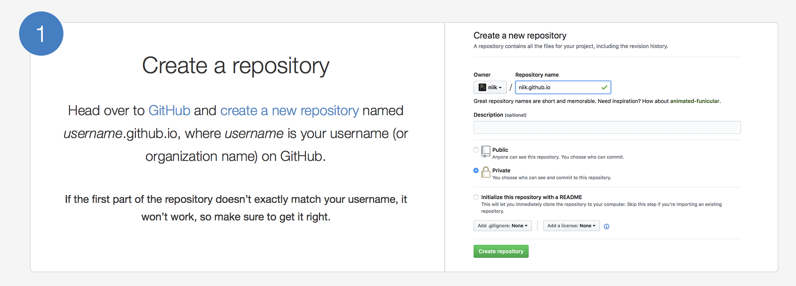
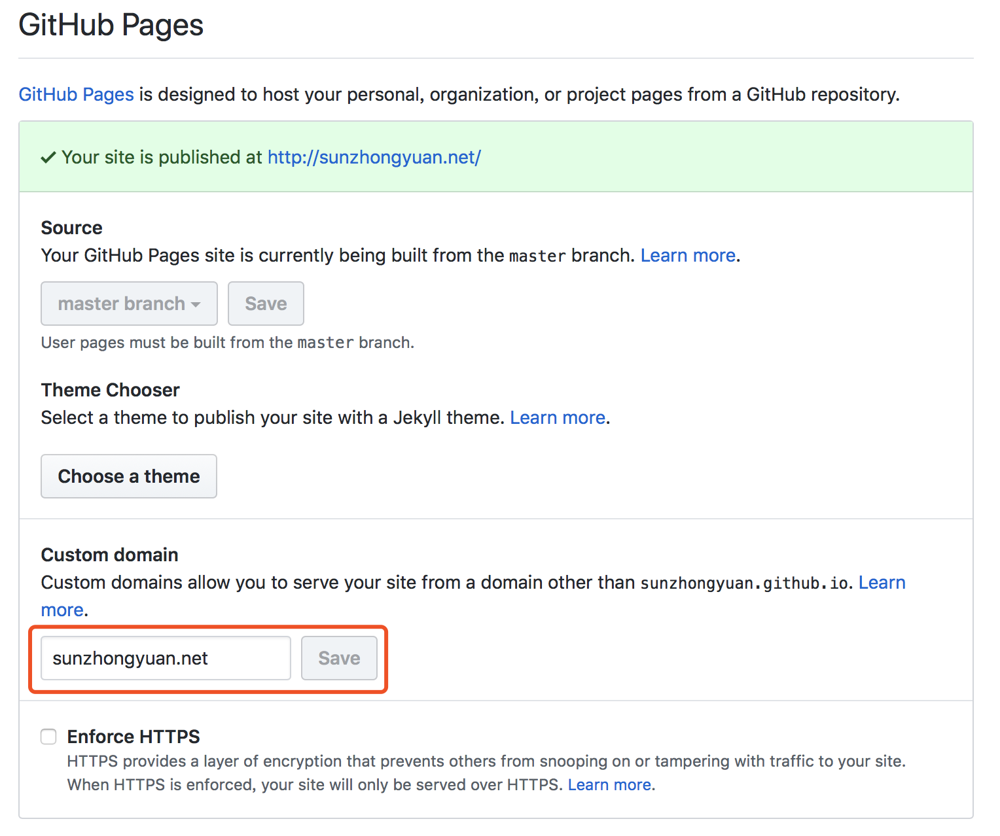
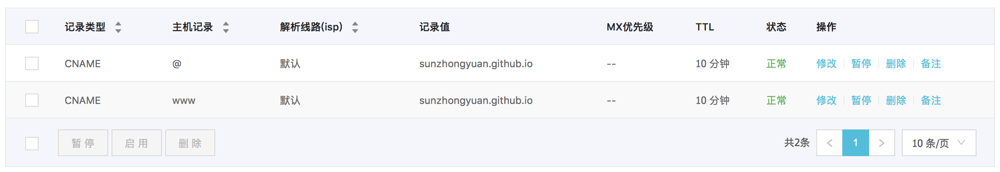

### 0.利用hexo在本地创建个人博客
创建方法参照：
[hexo中文官方文档](https://hexo.io/zh-cn/docs/)

### 1.在GitHub上创建一个项目
[GitHub Pages](https://pages.github.com)文档，可以了解一下，这里只用了第一步，创建一个项目。


### 2.将本地博客上传到GitHub上
0. 将本地git与GitHub绑定（通过SSH）
1. 执行
`npm install hexo-deployer-git --save`

2. 编辑Hexo的_config.yml文件
```
# Deployment
## Docs: https://hexo.io/docs/deployment.html
deploy:
  type: git
  repository: git@github.com:sunzhongyuan/sunzhongyuan.github.io.git
  branch: master
```
3. 执行`hexo d -g`将生成html文件上传到GitHub
4. 地址栏输入sunzhongyuan.github.io即可访问个人博客

### 3.绑定个人域名
0. 设置项目sunzhongyuan.github.io


1. 设置个人域名DNS解析

